# Proje Adı

Evcil Hayvan Takip Uygulaması

## Projenin amacı

Bu uygulama, kullanıcıların evcil hayvanlarının bakımını ve sağlık durumlarını takip
etmelerine olanak tanır. Uygulama, evcil hayvanların beslenme ve sağlık ihtiyaçlarını düzenli
olarak kaydetmeyi, izlemeyi ve hatırlatıcılar göndermeyi sağlar.

## Kullanılan Teknolojiler
Flutter: Mobil uygulama geliştirme framework'ü.
MVVM: Model-View-ViewModel mimarisi.
Provider: State management için.
Hive: Yerel veritabanı.

## Dosya Yapısı
lib/
  ├── base/
  │   ├── services/             # servisler
  │   └── viewmodels/           # ViewModel sınıfları
  ├── models/                  # Veritabanı modelleri
  ├── screens/                 # UI sayfaları
  ├── widgets/                 # Tekrar kullanılabilir widget'lar
  └── main.dart                # Uygulama başlangıcı

## Ekran Görüntüleri 

# Anasayfa
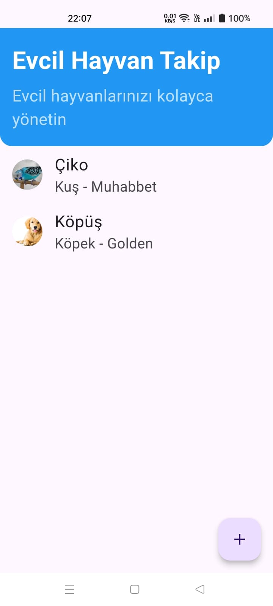

# Evcil Hayvan Ekleme
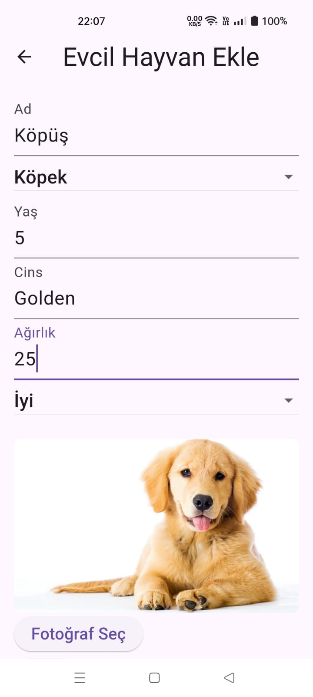

# Evcil Hayvan Detay
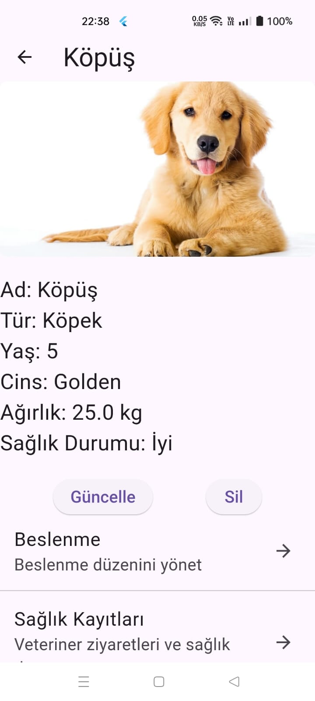

# Beslenme Kaydı Ekleme
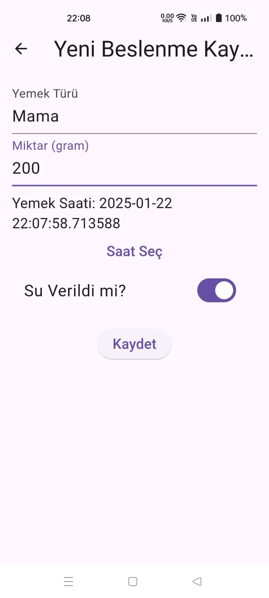

# Beslenme Kaydı Detay
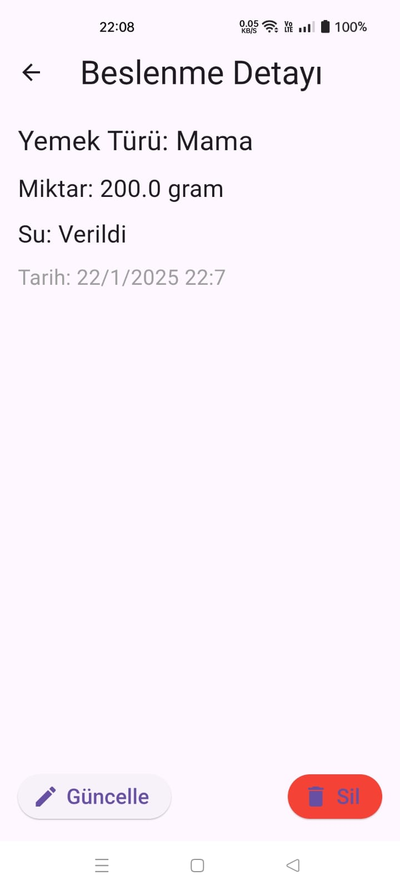

# Sağlık Kaydı Ekleme
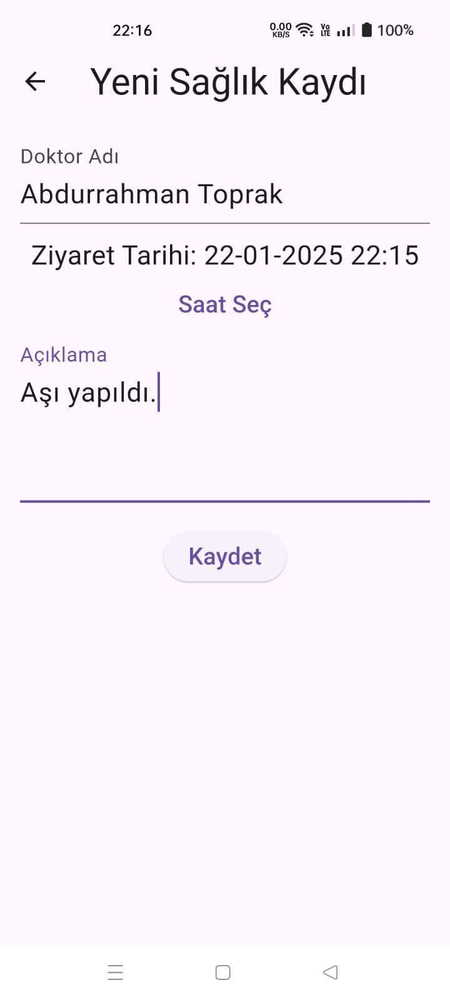

# Sağlık Kaydı Detay
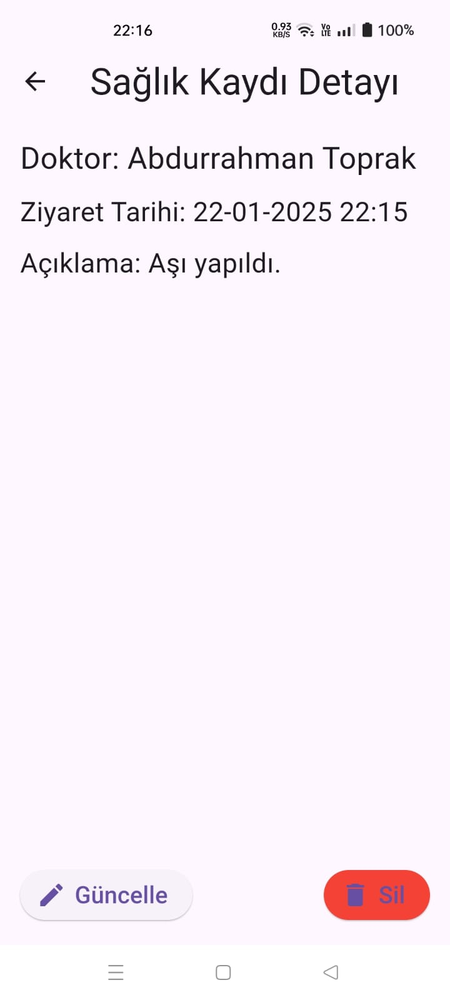

# Hatırlatıcı Ekleme(Tekrarlı, Tekrarsız)
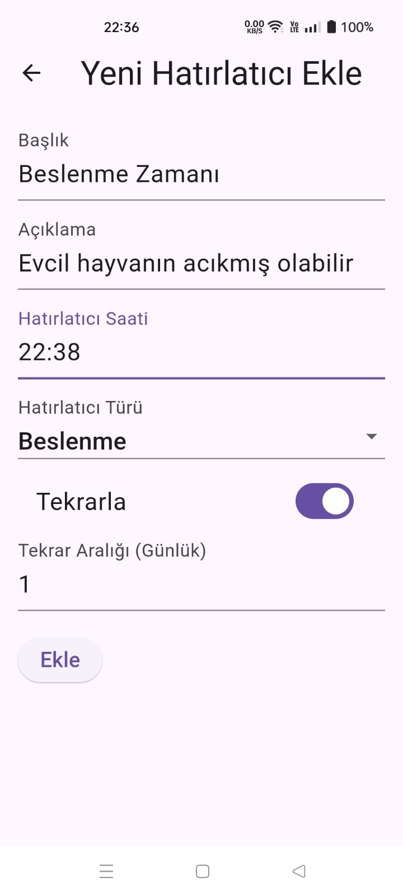
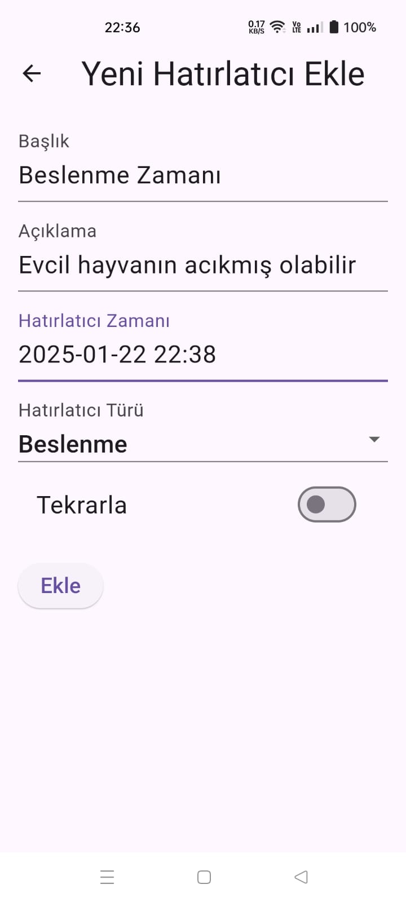

# Hatırlatıcı Detay
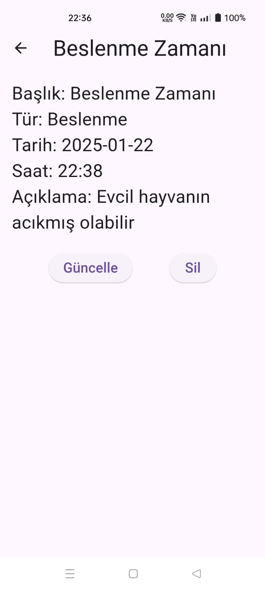

# Bildirim Örneği
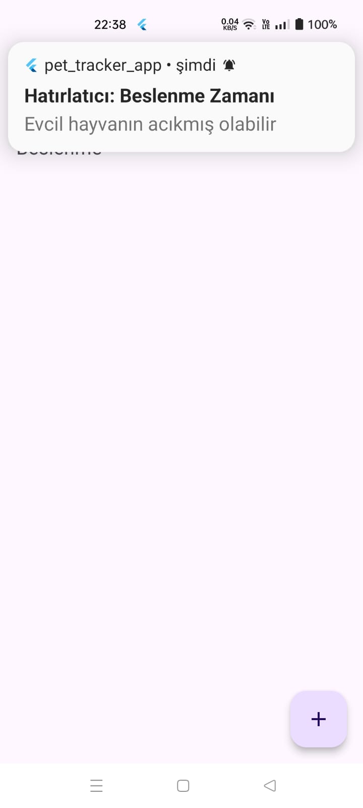
